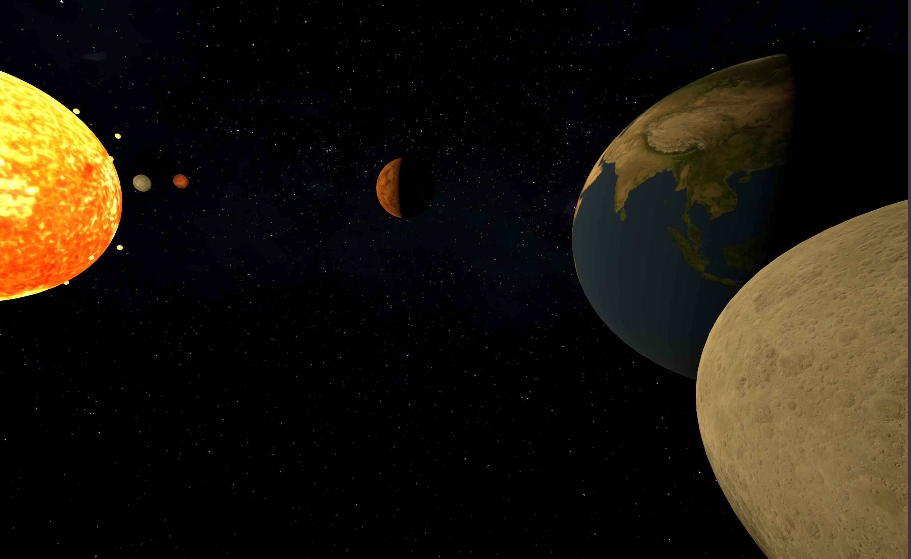
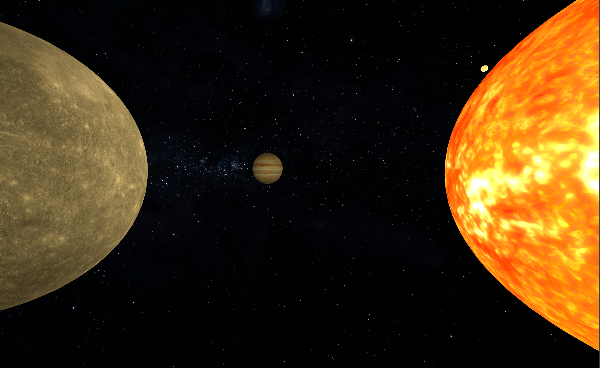
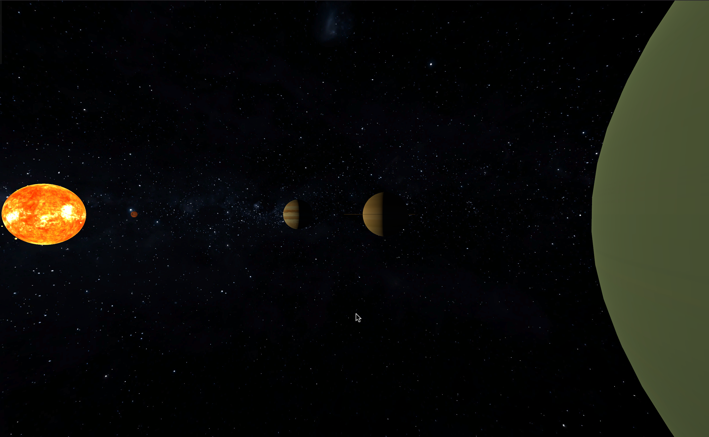

# Solar System Simulator

Solar System Simulator is a 3D animation that simulates the motion, light, and fire effects in the solar system using Godot Engine 4.6. Users can explore freely with the keyboard and mouse.

## Features
- Particle system for the solar corona
- UHD textures for the planets
- Keyboard controls
- Mouse-controlled view rotation

## Download / Play
1. [Install Godot 4.6 or later](https://godotengine.org/download).
2. Clone this repository to your device.
3. Import the 'project.godot' file and run the program.

## Keyboard controls
- WASD, arrow keys: move
- Space, Enter: move upwards
- Shift: move downwards

## Licenses
All code is licensed under the GNU GPL 3.0 License.

## Gallery

## Asset acknowledgements
All assets are used with permission under their respective licenses.  
**If a specific attribution is missing or incorrect, please contact me.**

Game engine (The MIT License): <https://godotengine.org>

Textures (Created by [INOVE](https://inove.eu.com), licensed under CC BY 4.0, **I modify and apply it to the sphere.**): <https://www.solarsystemscope.com/textures/>
